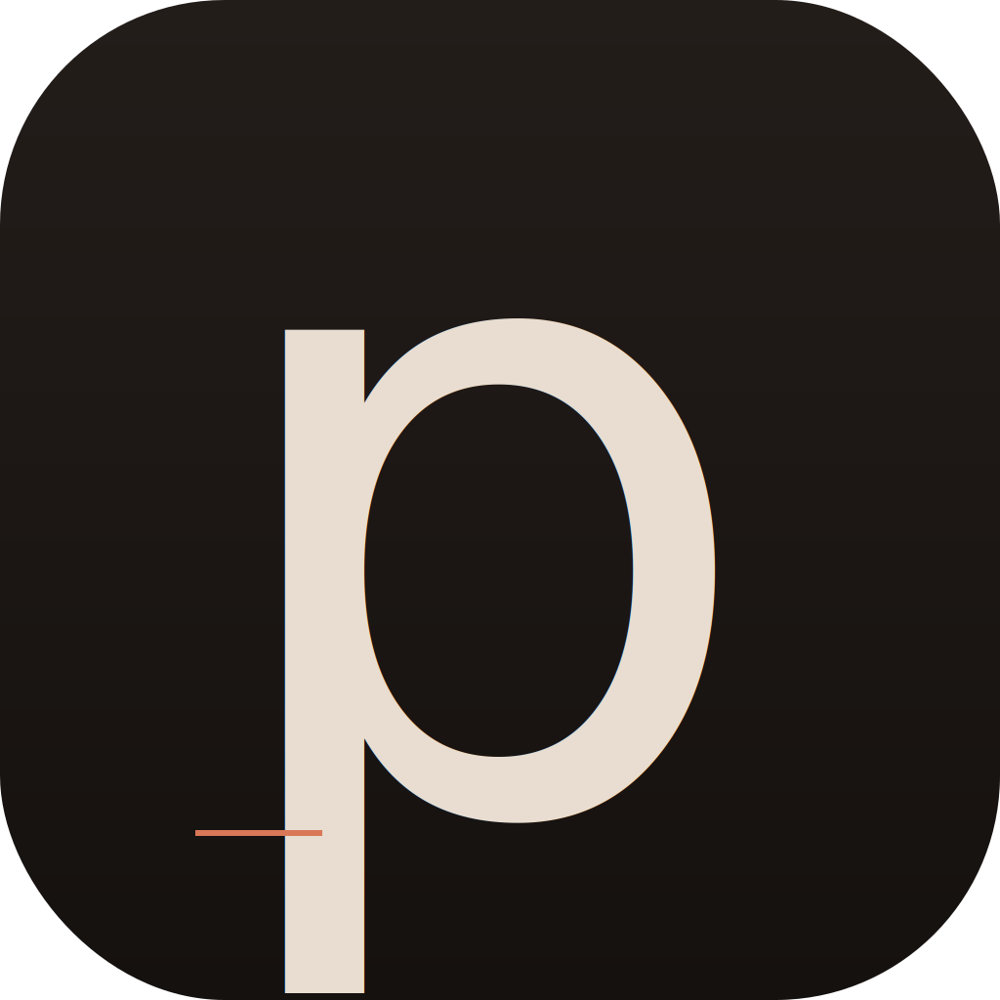

# Plate

Native macOS photo library for Hasselblad RAW (3FR / FFF) and modern HEIF/JPEG, designed for photographers Apple Photos can't ingest. Same-dir same-basename pairing folds HEIC + RAW into one asset; the SQLite-backed library bundle (`.plate`) is rescue-friendly (`Originals/yyyy/yyyy-MM-dd/` on disk, no opaque blobs).

- Swift + AppKit, macOS 10.15+
- No external dependencies — ImageIO, AVFoundation, CryptoKit, SQLite3 are all system frameworks
- `.plate` bundle: `Originals/`, `Caches/thumbs/`, `library.db`
- Year / Month / All Photos browsing; Favorites; user-defined Albums; soft-delete with Recently Deleted
- **Video & Live Photos** — movies (`.mov` / `.mp4` / …) import with a poster frame + duration and play in-viewer (AVPlayer); a still + same-basename `.mov` folds into one Live Photo (the still is the master, the clip plays on demand via `PHLivePhotoView`). The web gallery plays both too (`<video>` with HTTP Range)



## Building

```bash
# 1. PlateCore tests (pure SPM library, no Xcode needed)
swift test

# 2. PlateApp (AppKit shell — generates .xcodeproj via xcodegen)
brew install xcodegen
cd PlateApp
xcodegen generate
xcodebuild -project PlateApp.xcodeproj -scheme PlateApp -configuration Release build
```

Release builds land in `~/Library/Developer/Xcode/DerivedData/PlateApp-*/Build/Products/Release/Plate.app`.

## Layout

| Path | Role |
|------|------|
| `Sources/PlateCore/` | Library: store, pairer, scanner, EXIF + video metadata readers, thumbnailer, web gallery |
| `Sources/PlateCLI/` | `plate-cli` for ingest from terminal |
| `PlateApp/PlateApp/` | AppKit shell (windows, view controllers, menus) |
| `PlateApp/project.yml` | xcodegen manifest — single source of truth for the .xcodeproj |
| `Branding/` | Source SVGs + `scripts/build-icons.sh` regenerates `.icns` |
| `Tests/PlateCoreTests/` | XCTest cases for the library |

## CI

GitHub Actions on every push to `main` (and tags `v*`):

- `test-core` — `swift test` for PlateCore
- `build-debug` — verifies the AppKit target compiles (Debug `.app` uploaded on every run, incl. PRs)
- `build-release` — a per-architecture matrix (`arm64` + `x86_64`, built separately) producing, for each slice:
  - `Plate-macos-<arch>.zip` — the ad-hoc-signed `.app`
  - `plate-cli-macos-<arch>.tar.gz` — the CLI plus its PlateCore resource bundle
  - a `.sha256` sidecar for each

  Uploaded as 90-day workflow artifacts; all four (plus checksums) are attached to a GitHub Release when a `v*` tag is pushed. The `macos` runner is Apple Silicon, so the `x86_64` slice is cross-compiled (`ARCHS` / `--arch`).

## License

MIT — see [LICENSE](LICENSE).
